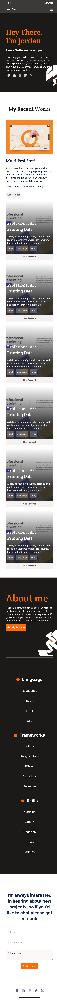
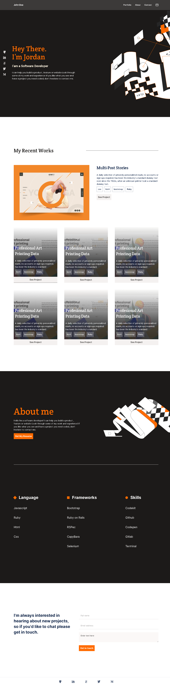

# My Portfolio
This is my frist Portfolio Project, in which I will be including all my pojects in order to show my programinng skills, here you could apreciate all my  amazing work.

## Links
To see this project live on the browser, click [here](https://jord4n-ac.github.io/portfolio/main.html)

## Screenshots
#### Mobile Version

#### Desktop Version

## Built With
- Major languages
  - HTML and CSS

- Frameworks
  - Visual Studio Code

## Getting Started
To get a local copy up and running follow these simple example steps.
### Prerequisites
- A Pc with any operative system
- An IDE (preferbly VSCode)
- A Version Control Sistem

### Setup
To start using this project you need:
- To clone this repository on your computer, using the git console run git clone (URL of the repository)
- Find the folder that contains the project
- Open the .html file on the browser

### Install
- Install code editor of your choice (used in this project VSCode)
- Install git on your computer

### Usage
You can use this project see all my projects, to learn from it, to propose new changes, to know and check how the structure of a Web Page looks like.

### Deployment
For deployment please rich out to the owner of this project

## Authors
👤 Jordan A
- GitHub: [Jord4N-AC](https://github.com/Jord4N-AC)
- Twitter: [@jordan12AC](https://twitter.com/jordan12AC)
- LinkedIn: [Camilo Armijos](https://www.linkedin.com/in/camilo-armijos-2b9648197)

👤 Abdullateef Bello
- GitHub: [Ibnballo1](https://github.com/Ibnballo1)
- LinkedIn: [Abdullateef Bello](https://www.linkedin.com/in/camilo-armijos-2b9648197)

👤 Kemigabo Catherine
- GitHub: [kemigabocatherine](https://github.com/kemigabocatherine)
- Twitter: @twitterhandle

## 🤝 Contributing
Contributions, issues, and feature requests are welcome!

## Show your support
Give a ⭐️ if you like this project!

## 📝 License
This project is [MIT](https://github.com/microverseinc/readme-template/blob/master/MIT.md) licensed.
